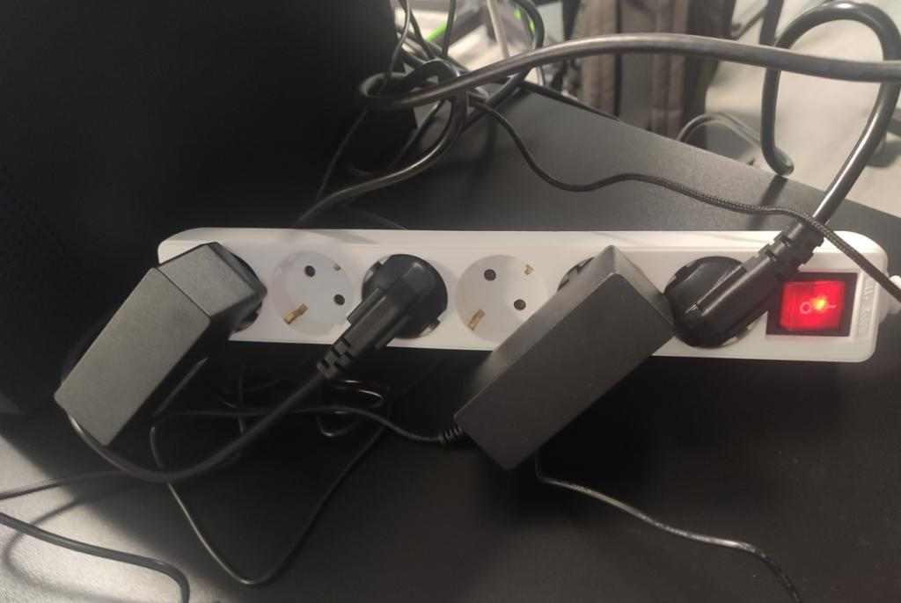
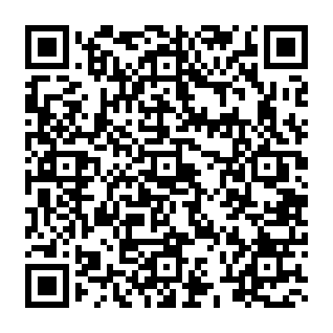

En este proyecto utilizamos el motor de videojuegos Unity para crear una aplicación de Realidad Aumenteada que intenta aducar o concienciar ante un peligro real.

Se plantea una situación en la que se descuida el cuidado de un bebé.
Se muestra una posible desgracia en la que el bebé alcanza a meter sus pequeños dedos por el enchufe de la pared.
Teniendo un desenlace fatal.
¿Te lo pensarás más la proxima vez que quieras usar el móvil y dejar a tu hijo solo?

Se han utilizado tecnologías de RA como Vuforia (para incluir las imágenes y su detección), diversos paquetes de Unity, y la herramienta de Realidad Virtual (Polycam) que permite escanear un objeto de la vida real para transformarlo en un objeto 3D y añadirlo al proyecto.

# Imágenes para usar en la aplicación
- [Carpeta](https://github.com/Ruben-Armas/AR-Unity-Vuforia/tree/1366e3aa749ce27bf474da8e5973c3854c224bcd/img/Target)
  

# Cómo descargar la aplicación
- [Enlace](https://drive.google.com/file/d/161b0qrRWuHbTDLhzOZBFOMIwFtMCIks2/view?usp=sharing)

# Vídeos demostrativos
- [Enlace](https://drive.google.com/drive/folders/1jkdcgDkmHgNLpnykILjbSWLep0dq2JNM?usp=sharing)
